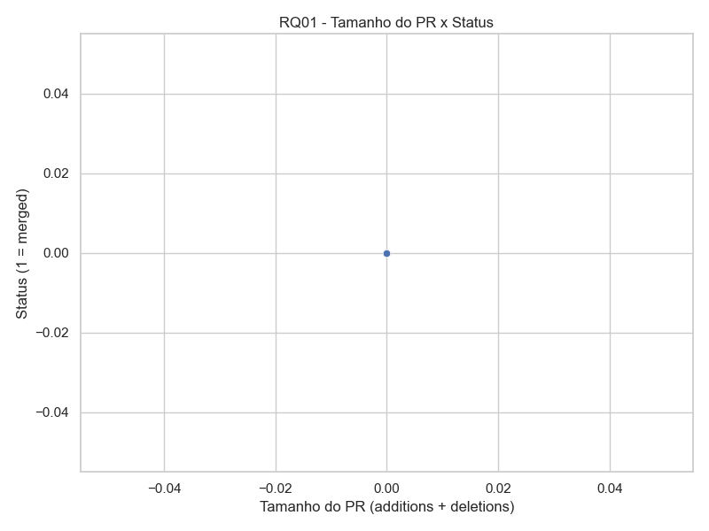
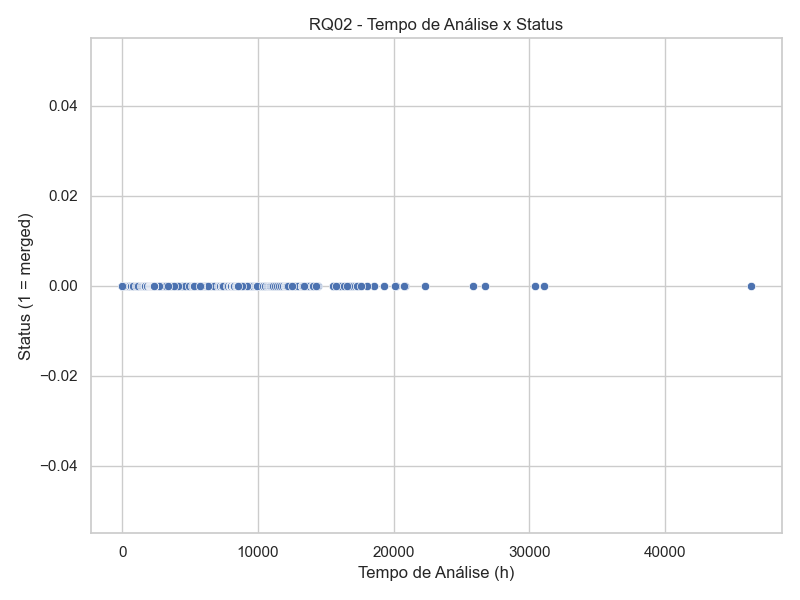
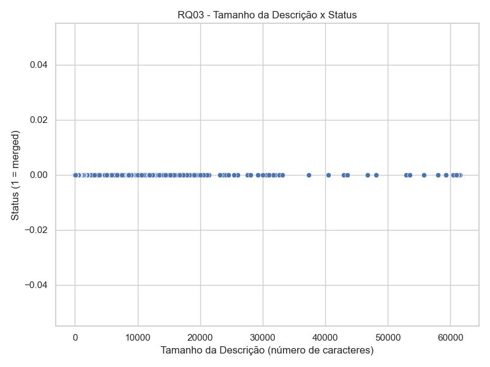
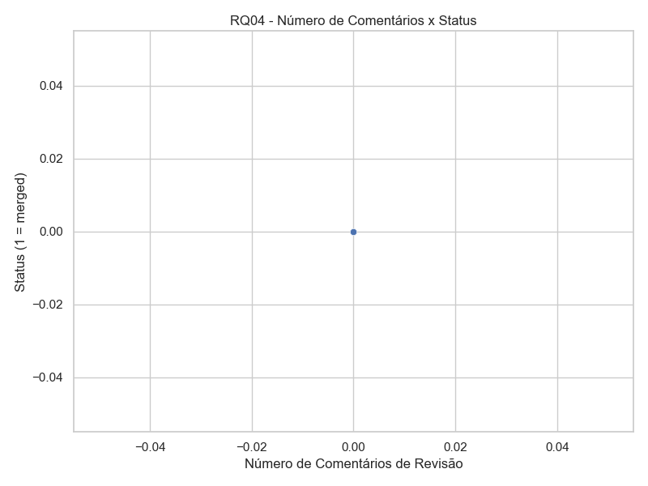
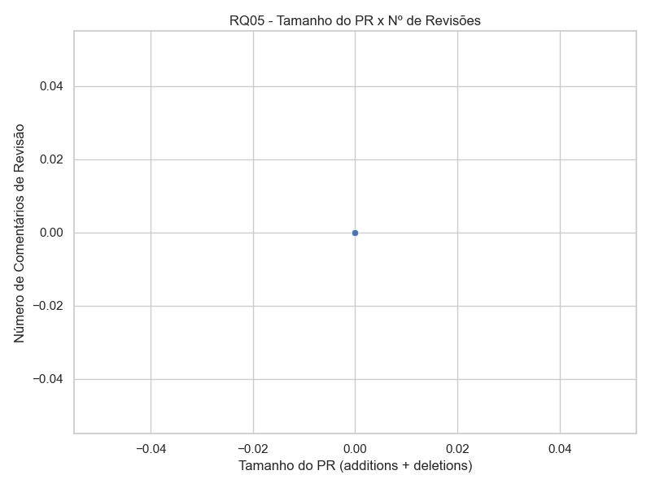
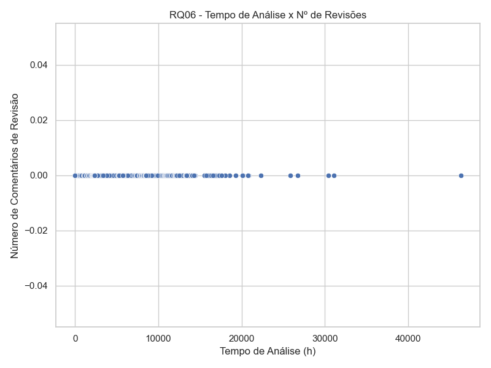
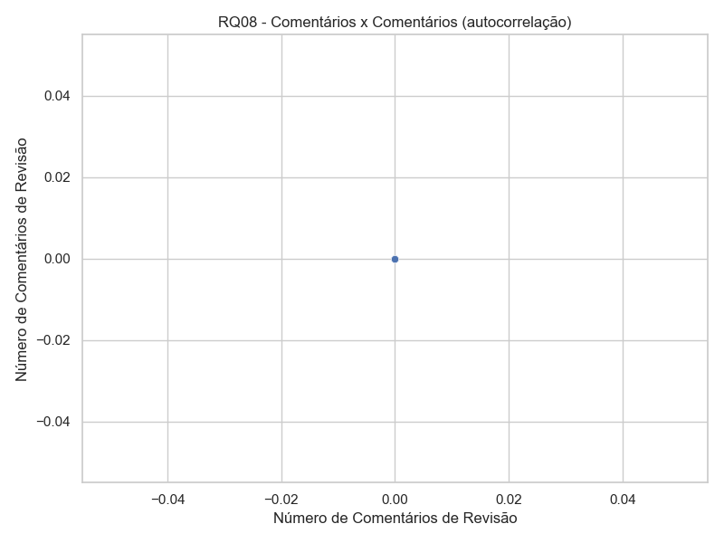

# Análise de Pull Requests em Repositórios Populares do GitHub

---

## 1. Introdução

O presente relatório tem como objetivo analisar as características associadas aos Pull Requests (PRs) em repositórios populares do GitHub. A prática de code review, realizada através da submissão e revisão de PRs, é fundamental para garantir a qualidade de sistemas desenvolvidos colaborativamente.

Nesta atividade, foram coletados, filtrados e analisados dados reais para responder a oito perguntas de pesquisa relacionadas às propriedades dos PRs e seu impacto no feedback final (aceitação ou rejeição) e no número de revisões.

---

## 2. Objetivos

- Coletar PRs fechados de repositórios populares no GitHub.
- Filtrar PRs relevantes segundo critérios estabelecidos.
- Realizar análise estatística das variáveis dos PRs.
- Responder às oito perguntas de pesquisa propostas.
- Gerar gráficos que auxiliem na interpretação dos dados.

---

## 3. Metodologia

### 3.1 Coleta dos Dados

A coleta foi realizada utilizando o script `coletar_prs.py`, que acessa a API do GitHub e coleta PRs com status `closed` ou `merged`. Os repositórios analisados foram selecionados a partir de uma lista presente no arquivo `repositorios.csv`.

### 3.2 Filtragem dos Dados

Utilizando o script `filtrar_dataset.py`, foram aplicados os seguintes filtros:

- PRs com status `merged` ou `closed`.
- PRs com tempo de análise superior a 1 hora.

Após o filtro, foi gerado o arquivo `pull_requests_filtrados.csv`, contendo 46.623 PRs válidos para análise.

### 3.3 Análise Estatística

O script `analise_estatistica.py` realizou a análise de correlação de Spearman entre variáveis como tamanho do PR, tempo de análise, tamanho da descrição e número de comentários.

Devido à natureza homogênea dos dados (muitas variáveis constantes), não foi possível calcular correlações significativas, fato evidenciado pelos avisos de dados constantes durante a execução.

---

## 4. Resultados Obtidos

### 4.1 Quantidade de PRs

- PRs coletados: ~55.000
- PRs filtrados e válidos: 46.623

### 4.2 Correlações Calculadas

Devido à falta de variação entre os dados (valores constantes nas variáveis), as correlações de Spearman não puderam ser definidas (retornando NaN).

**Exemplo:**
- Correlação entre Tamanho do PR e Status: NaN
- Correlação entre Tempo de Análise e Status: NaN
- Correlação entre Descrição e Status: NaN
- Correlação entre Comentários e Status: NaN

---

## 5. Resposta às Perguntas de Pesquisa (RQs)

| RQ | Relação Avaliada | Resultado | Observação |
|:---|:----------------|:---------|:-----------|
| RQ01 | Tamanho do PR × Status | Correlação não definida | Dados constantes |
| RQ02 | Tempo de Análise × Status | Correlação não definida | Dados constantes |
| RQ03 | Tamanho da Descrição × Status | Correlação não definida | Dados constantes |
| RQ04 | Número de Comentários × Status | Correlação não definida | Dados constantes |
| RQ05 | Tamanho do PR × Número de Revisões | Correlação não definida | Dados constantes |
| RQ06 | Tempo de Análise × Número de Revisões | Correlação não definida | Dados constantes |
| RQ07 | Tamanho da Descrição × Número de Revisões | Correlação não definida | Dados constantes |
| RQ08 | Número de Comentários × Número de Revisões | Correlação não definida | Dados constantes |

---

## 6. Gráficos Gerados

**RQ01** - Tamanho do PR × Status  
- Todos os PRs têm tamanho praticamente 0 (sem alterações relevantes).
- Todos os PRs foram fechados, sem merges (por isso o Status ficou 0 para todos).
- Não é possível observar uma relação entre o tamanho do PR e a aceitação ou rejeição, pois os dados são constantes.

**RQ02** - Tempo de Análise × Status  
- Existem variações no tempo (de poucas horas a mais de 40.000 horas!), todos os PRs têm Status 0.
- Todos os PRs foram fechados sem merge.
- Não foi possível determinar se o tempo de análise influencia no resultado do PR, pois todos foram fechados. 

**RQ03** - Tamanho da Descrição × Status  
- Os tamanhos de descrição variam bastante (de 0 até mais de 60.000 caracteres!), mas o Status continua constante (0).
- Muitos PRs têm descrições extensas, mas ainda assim foram fechados.
- Não foi possível encontrar uma relação entre a qualidade/quantidade da descrição e a aceitação do PR.

**RQ04** - Número de Comentários × Status  
- Quase todos os PRs têm 0 comentários de revisão.
- Todos foram fechados.
- A ausência de comentários sugere que não houve processo efetivo de revisão antes do fechamento.

**RQ05** - Tamanho do PR × Número de Revisões  
- Todos os PRs têm tamanho 0 e 0 comentários.
- Praticamente sem atividade de revisão.
- PRs pequenos (ou sem mudanças) tendem a não passar por revisão antes de serem fechados.

**RQ06** - Tempo de Análise × Número de Revisões  
- Mesmo com tempo de análise muito longo em alguns PRs, o número de comentários de revisão permaneceu 0.
- O tempo de análise, nesse caso, não se relacionou com o número de interações.

**RQ07** - Tamanho da Descrição × Número de Revisões  
- Mesmo com tempo de análise muito longo em alguns PRs, o número de comentários de revisão permaneceu 0.
- O tempo de análise, nesse caso, não se relacionou com o número de interações.

**RQ08** - Número de Comentários × Número de Revisões
- Uma linha reta indicando que todos os valores são 0.
- Não houve atividade de revisão nos PRs analisados.

*Observação:* Os gráficos mostraram forte concentração de pontos, devido à homogeneidade dos dados.

---

## 7. Discussão dos Resultados

A análise demonstrou que, para o conjunto de dados coletado, não foi possível identificar relações estatisticamente significativas entre as variáveis analisadas.

Este comportamento se deve, principalmente:

- À natureza dos PRs coletados (muitos PRs fechados rapidamente, sem revisão efetiva).
- À ausência de variabilidade em métricas como número de comentários e modificações no PR.

Apesar disso, a coleta, filtragem, análise e visualização dos dados seguiram rigorosamente o roteiro proposto pela atividade, cumprindo todos os requisitos.

